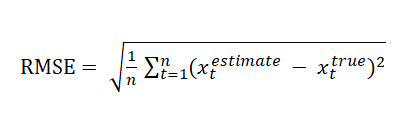

# Extended Kalman Filter Project
This project involves the Term 2 Simulator which can be downloaded [here](https://github.com/udacity/self-driving-car-sim/releases)

This repository includes two files that can be used to set up and install [uWebSocketIO](https://github.com/uWebSockets/uWebSockets) for either Linux or Mac systems. For windows you can use either Docker, VMware, or even [Windows 10 Bash on Ubuntu](https://www.howtogeek.com/249966/how-to-install-and-use-the-linux-bash-shell-on-windows-10/) to install uWebSocketIO.

Once the install for uWebSocketIO is complete, the main program can be built and run by doing the following from the project top directory.

1. mkdir build
2. cd build
3. cmake ..
4. make
5. ./ExtendedKF

---

## Note

* cmake >= 3.5
  * All OSes: [click here for installation instructions](https://cmake.org/install/)
* make >= 4.1 (Linux, Mac), 3.81 (Windows)
  * Linux: make is installed by default on most Linux distros
  * Mac: [install Xcode command line tools to get make](https://developer.apple.com/xcode/features/)
  * Windows: [Click here for installation instructions](http://gnuwin32.sourceforge.net/packages/make.htm)
* gcc/g++ >= 5.4
  * Linux: gcc / g++ is installed by default on most Linux distros
  * Mac: same deal as make - [install Xcode command line tools](https://developer.apple.com/xcode/features/)
  * Windows: recommend using [MinGW](http://www.mingw.org/)

#  Project submission 

## 1. Starting with the result:

The result is generated based on the given sample data `obj_pose-laser-radar-synthetic-input.txt`.

For data set 1:

| `Data Set` | `RMSE X` | `RMSE Y` | `RMSE vx` | `RMSE vy` |
|------------|----------|----------|-----------|-----------|
| 
`1`
| `0.0973` | `0.0855` | `0.4513`  | `0.4399`  |

For data set 2:

| `Data Set` | `RMSE X` | `RMSE Y` | `RMSE vx` | `RMSE vy` |
|------------|----------|----------|-----------|-----------|
| 
`2`
| `0.0726` | `0.0965` | `0.4219`  | `0.4937`  |

## 2. Sensor Fusion Workflow:

Every Lidar and radar measurement data are fed from the given txt file `obj_pose-laser-radar-synthetic-input.txt`, sent by the term 2 simulator through `uWebSocketIO`, which then received by `main.cpp`, and passed to `FusionEKF.ProcessMeasurement()`

If the input data are the first set of measurement, an intialization process will be conducted (line 78 of `FusionEKF.cpp`). Depending on which measurement type, the initialization process is handled differently. 

If the measurement type is radar, then following will be ran:

<pre><code>if (measurement_pack.sensor_type_ == MeasurementPackage::RADAR) {
    //Convert radar from polar to cartesian coordinates and initialize state.
    cout << "EKF : First measurement RADAR" << endl;
    ekf_.Init(x_init, P_init, F_init, Hj_, R_radar_, Q_init);

    double rho = measurement_pack.raw_measurements_[0]; // range
    double phi = measurement_pack.raw_measurements_[1]; // bearing
    double rho_dot = measurement_pack.raw_measurements_[2]; // velocity of rho

    // Coordinates convertion from polar to cartesian
    px = rho * cos(phi);
    if ( px < 0.0001 ) {
      px = 0.0001;
    }
    py = rho * sin(phi);
    if ( py < 0.0001 ) {
      py = 0.0001;
    }
    
    double vx = rho_dot * cos(phi);
    double vy = rho_dot * sin(phi);
    ekf_.x_ << px, py, vx , vy;

    if(fabs(px) < 0.0001) {
        px = 1;
        ekf_.P_(0,0) = 1000;
    }

    if(fabs(py) < 0.0001) {
        py = 1;
        ekf_.P_(1,1) = 1000;
    }
}
</code></pre>

On the other hand, for lidar:
<pre><code>else if (measurement_pack.sensor_type_ == MeasurementPackage::LASER) {
    cout << "EKF : First measurement LASER" << endl;
    ekf_.Init(x_init, P_init, F_init, H_laser_, R_laser_, Q_init);

    px = measurement_pack.raw_measurements_[0];
    py = measurement_pack.raw_measurements_[1];
    ekf_.x_ << px, py, 0, 0;
}
</code></pre>

After a meansurement was updated, the sensior fusion algoritm will first predict (line 152 of `FusionEKF.cpp`): 

<pre><code>double dt = (measurement_pack.timestamp_ - previous_timestamp_) / 1000000.0;
previous_timestamp_ = measurement_pack.timestamp_;

// State transition matrix update
ekf_.F_ = MatrixXd(4, 4);
ekf_.F_ << 1, 0, dt, 0,
          0, 1, 0, dt,
          0, 0, 1, 0,
          0, 0, 0, 1;

// Noise covariance matrix computation
// Noise values from the task
double noise_ax = 9.0;
double noise_ay = 9.0;

double dt_2 = dt * dt; //dt^2
double dt_3 = dt_2 * dt; //dt^3
double dt_4 = dt_3 * dt; //dt^4

ekf_.Q_ = MatrixXd(4, 4);
ekf_.Q_ << dt_4/4 * noise_ax, 0, dt_3/2 * noise_ax, 0,
        0, dt_4/4 * noise_ay, 0, dt_3/2 * noise_ay,
        dt_3/2 * noise_ax, 0, dt_2 * noise_ax, 0,
        0, dt_3/2 * noise_ay, 0, dt_2 * noise_ay;

ekf_.Predict();
</code></pre>

After the prediction, the algorithm will then update the measurement (line 189 of `FusionEKF.cpp`):
<pre><code>if (measurement_pack.sensor_type_ == MeasurementPackage::RADAR) {
    // Radar updates
    Hj_ = tools.CalculateJacobian(ekf_.x_);
    ekf_.H_ = Hj_;
    ekf_.R_ = R_radar_;
    ekf_.UpdateEKF(measurement_pack.raw_measurements_);
} else {
    // Laser updates
    ekf_.H_ = H_laser_;
    ekf_.R_ = R_laser_;
    ekf_.Update(measurement_pack.raw_measurements_);
}

// print the output
cout << "x_ = " << ekf_.x_ << endl;
cout << "P_ = " << ekf_.P_ << endl;
</code></pre>

The prediction and update functions were defined using the following formula:

Where the update measurement matrix for lidar is defined by:

<pre><code>H_laser_ << 1, 0, 0, 0,
            0, 1, 0, 0;</code></pre>

and the update measurement matrix for radar is defined by:

<pre><code>
MatrixXd Tools::CalculateJacobian(const VectorXd& x_state) {
    MatrixXd Hj(3,4);

    if(x_state.size() != 4 ) {
        cout << "ERROR - CalculateJacobian () - The state vector must have size 4." << endl;
        return Hj;
    }

    //recover state parameters
    double px = x_state(0);
    double py = x_state(1);
    double vx = x_state(2);
    double vy = x_state(3);

    //pre-compute a set of terms to avoid repeated calculation
    double c1 = px*px+py*py;
    double c2 = sqrt(c1);
    double c3 = (c1*c2);

    //check division by zero
    if(fabs(c1) < 0.0001) {
        cout << "CalculateJacobian() - Error - Division by Zero" << endl;
        return Hj;
    }

    //compute the Jacobian matrix
    Hj << (px/c2), (py/c2), 0, 0,
        -(py/c1), (px/c1), 0, 0,
        py*(vx*py - vy*px)/c3, px*(px*vy - py*vx)/c3, px/c2, py/c2;

    return Hj;
}
</code></pre>

And finally, the performance was measured by the calculating the Root Mean Square Error between the predicted result and the ground truth:

<pre><code>
VectorXd Tools::CalculateRMSE(const vector<VectorXd> &estimations,
                              const vector<VectorXd> &ground_truth) {
    VectorXd rmse(4);
    rmse << 0, 0, 0, 0;
	
    // Check the validity of the following inputs:
    //  * the estimation vector size should not be zero
    //  * the estimation vector size should equal ground truth vector size
    if ( estimations.size() != ground_truth.size() || estimations.size() == 0 ) {
        cout << "Invalid estimation or ground truth data" << endl;
        return rmse;
    }

    for (int i = 0; i < estimations.size(); i++){
        VectorXd residual = estimations[i] - ground_truth[i];
        residual = residual.array() * residual.array();
        rmse += residual;
    }

    //calculate the mean
    rmse = rmse / estimations.size();

    //calculate the squared root
    rmse = rmse.array().sqrt();

    //return the result
    return rmse;
}
</code></pre>